# Camera Health Assessment cho ADAS — Báo cáo nhóm

**Nhóm LiDAR · K4 Track 4 Day 04 · Sensor Reality Sprint** — thành viên: [TEAMMATES.md](../TEAMMATES.md)

> **Tóm tắt.** Mô hình nhận 1 ảnh camera, tính 11 IQA features (blur, sáng/tối, nhiễu, tương phản...) rồi dùng XGBoost dự đoán **Camera Health ∈ [0, 1]**: tỉ lệ object mà detector còn phát hiện được so với khi ảnh sạch. Trên ACDC rain (6 330 ảnh test, 15 điều kiện), XGBoost đạt **MAE 0.146, R² 0.62, Spearman 0.75, accuracy 3 lớp 73%**. Kết quả này tốt hơn rule-based (Spearman 0.07) và Linear Regression (0.67), ngang Random Forest. Điểm yếu lớn nhất: với **ảnh mưa thật**, model chấm gần như mọi ảnh là Healthy, vì lỗi thật chủ yếu là cần gạt nước che khuất cục bộ chứ không phải suy giảm toàn ảnh (§7).

---

## 1. Bài toán & định nghĩa Health

Một điểm số IQA (độ nét, độ sáng...) chưa trả lời câu hỏi ADAS cần: *camera này còn đủ tin cậy cho perception không?* Vì vậy nhãn được định nghĩa qua **hiệu năng detector**:

```
health = recall_YOLO11s(ảnh degraded) / recall_YOLO11s(ảnh sạch cùng cảnh)      (clip về [0, 1])
```

| Lớp | Ngưỡng | Ý nghĩa vận hành |
|---|---|---|
| Healthy | health ≥ 0.8 | dùng bình thường |
| Degraded | 0.5 ≤ health < 0.8 | giảm trọng số trong fusion |
| Critical | health < 0.5 | không tin camera, cảnh báo / fallback |

Detector chỉ chạy **offline** để tạo nhãn. Lúc chạy thực tế, hệ thống chỉ cần tính 11 feature (~0.12 s/ảnh 1280×720 trên 1 nhân CPU, đo trên máy local) và gọi XGBoost (< 1 ms).

## 2. Pipeline

```
ACDC rain *_ref (ảnh trời quang)                                   ảnh mưa thật ACDC
        │ resize 1280×720                                                │
        ├─► 14 degradation pixel-aligned (rain/blur/noise/dark/over)     │
        │                                                                │
        ├─► YOLO11x (conf 0.4) trên ảnh sạch ──► pseudo-GT boxes          │
        ├─► YOLO11s (conf 0.25) trên 15 biến thể ──► matching IoU≥0.5 ──► recall ──► health label
        │                                                                │
        └─► 11 IQA features (+36 grid) ◄─────────────────────────────────┘
                     │
                     ▼
              XGBoost ──► Camera Health ──► class + camera weight
```

| Bước | Code | Chạy ở đâu |
|---|---|---|
| Degradation + detector + features | [kaggle/pipeline.py](../kaggle/pipeline.py), [features/](../features/) | Kaggle GPU T4, ~13 phút |
| Nhãn health | [health_model/make_labels.py](../health_model/make_labels.py) | local |
| Train / benchmark | [train_xgboost.py](../health_model/train_xgboost.py), [baselines.py](../health_model/baselines.py), [evaluate.py](../health_model/evaluate.py) | local CPU, < 1 phút |
| Sản phẩm cuối | [health_model/predict.py](../health_model/predict.py) | local |

## 3. Dữ liệu

- **Nguồn:** ACDC `rgb_anon`, điều kiện *rain* ([Kaggle](https://www.kaggle.com/datasets/njayadithya/rgb-anon-trainvaltest)). Bản này **không có nhãn GT** (box hay segmentation), nên nhóm dùng pseudo-GT từ YOLO11x.
- **Ảnh sạch:** 1 000 ảnh tham chiếu trời quang `*_ref`, giữ split gốc của ACDC theo sequence: train 400 · val 100 · test 500.
- **15 biến thể / ảnh:** clean, rain L1–3, blur L1–4 (σ = 1/2/3.5/6), noise L1–3 (σ = 10/25/45), dark L1–2, overexposure L1–2 → 15 000 ảnh.
- **Lọc nhãn:** bỏ ảnh có < 3 object trong pseudo-GT (recall quá nhiễu) → **11 280 nhãn**: train 3 930 · val 1 020 · test 6 330.
- **Ảnh mưa thật:** 1 000 ảnh, chỉ dùng để kiểm chứng ngoài phân phối (OOD). Các ảnh này không có ảnh sạch khớp pixel nên không tính được recall thật.

Recall trung bình của YOLO11s (so với pseudo-GT) giảm dần theo từng mức, nhờ đó nhãn tách bạch được các mức:

| | clean | rain 1/2/3 | blur 1/2/3/4 | noise 1/2/3 | dark 1/2 | over 1/2 |
|---|---|---|---|---|---|---|
| recall | 0.93 | 0.88 / 0.63 / 0.20 | 0.88 / 0.78 / 0.58 / 0.21 | 0.85 / 0.64 / 0.26 | 0.87 / 0.67 | 0.92 / 0.83 |

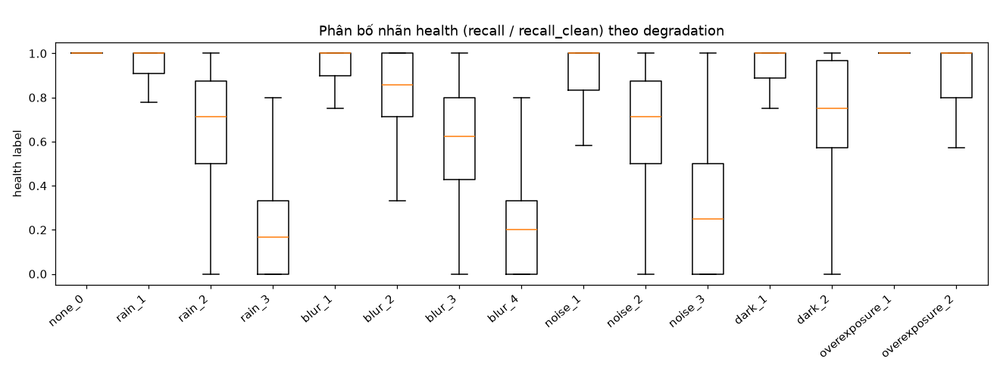

## 4. Ví dụ Ground Truth: ảnh degraded khác ảnh sạch ở đâu

Box **xanh** = object trong pseudo-GT (YOLO11x trên ảnh sạch) mà YOLO11s vẫn phát hiện; **đỏ** = bị bỏ sót; **vàng** = false positive. Tiêu đề mỗi ô ghi recall, health GT và health dự đoán.

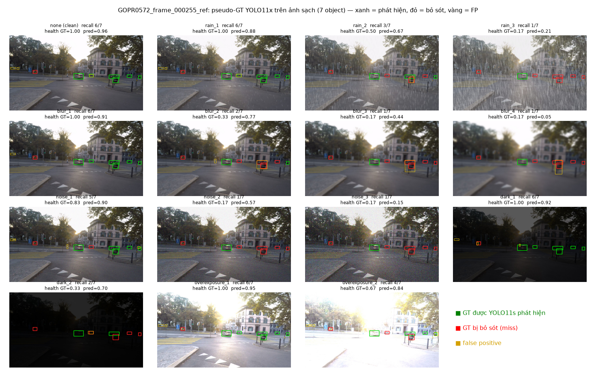

**Zoom vào một object** (xe máy): xem chi tiết nào mất đi ở từng mức.

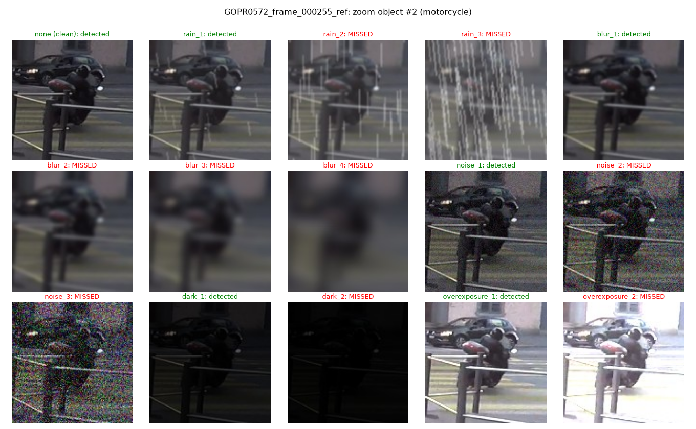

**Bản đồ sai khác |degraded − clean|** (sáng = khác nhiều):

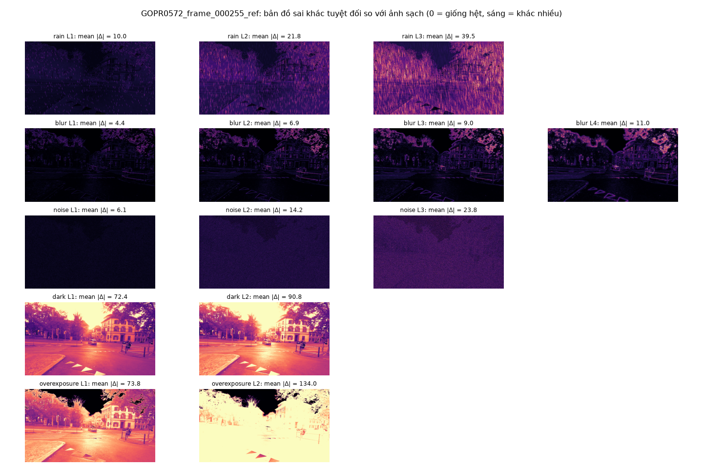

Nhận xét theo từng loại:

| Loại | Khác ảnh sạch ở đâu | Ảnh hưởng tới detector |
|---|---|---|
| **Rain** | Vệt mưa phủ toàn ảnh + lớp haze làm giảm tương phản; L3 che gần hết object nhỏ ở xa | L1 gần như vô hại (health 0.95); từ L2 mất object nhỏ/xa (0.69); L3 chỉ còn object lớn gần xe (0.22) |
| **Blur** | Sai khác tập trung ở **cạnh và vùng chi tiết** (tán cây, mép nhà, vạch kẻ); vùng phẳng hầu như không đổi | Mất object nhỏ trước; L4 còn lại vài object lớn |
| **Noise** | Sai khác **đều khắp ảnh**, biên độ nhỏ (mean \|Δ\| 6–24) | Phá kết cấu bề mặt: L3 (σ=45) chỉ còn health 0.32 dù ảnh "trông vẫn rõ" |
| **Dark** | Sai khác pixel **rất lớn** (mean \|Δ\| 72–91) | Dark L1 vẫn health 0.93; YOLO chịu tối tốt hơn chịu noise |
| **Overexposure** | Bầu trời và mặt đường cháy trắng | L2 cháy gần hết ảnh nhưng health vẫn 0.91, vì xe/người thường tối hơn nền nên không bị cháy |

**Bài học:** **mức sai khác pixel không phản ánh mức suy giảm perception**. Dark L1 khác ảnh sạch 72 mức xám nhưng gần như không hại detector. Rain L2 chỉ khác 22 mức nhưng mất 31% object. Đó là lý do nhãn phải lấy từ detector chứ không lấy từ PSNR/SSIM. Các ví dụ khác: [165](figures/examples_GOPR0572_frame_000165_ref.png), [185](figures/examples_GOPR0572_frame_000185_ref.png), [271](figures/examples_GOPR0572_frame_000271_ref.png), [278](figures/examples_GOPR0572_frame_000278_ref.png), [284](figures/examples_GOPR0572_frame_000284_ref.png) (mỗi ảnh có kèm file `diff_*` và `zoom_*` tương ứng).

## 5. Feature Engineering (Member 2)

11 feature toàn ảnh trên ảnh xám 1280×720 ([features/](../features/)): `laplacian_variance`, `mean_brightness`, `brightness_std`, `contrast` (p95−p5), `entropy`, `saturation_ratio` (≥250), `dark_pixel_ratio` (≤20), `noise_estimate` (Immerkær 1996), `edge_density` (Canny), `gradient_magnitude` (Sobel), `color_statistics` (colorfulness, Hasler & Süsstrunk 2003). Ngoài ra có 36 feature lưới 3×3 cho 4 feature (`<feature>_r{row}c{col}`).

**Mỗi loại degradation để lại một "dấu vân tay" riêng trên các feature** (median log2 tỉ lệ so với ảnh sạch cùng cảnh):

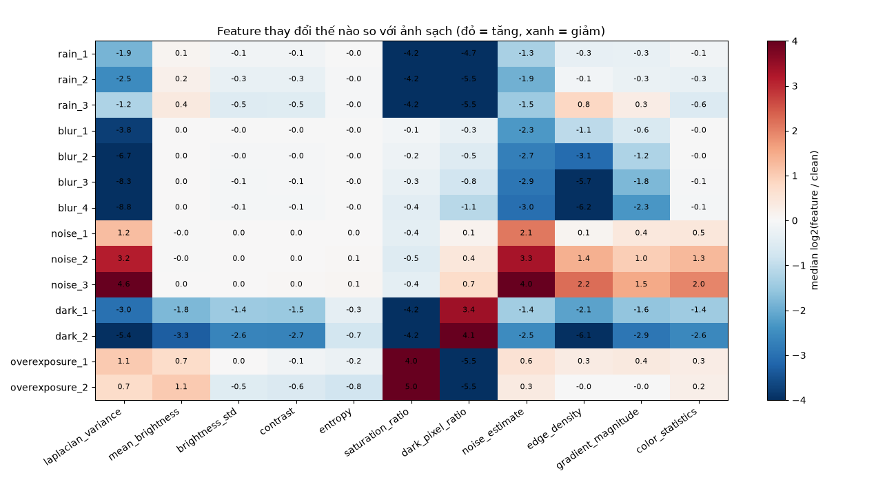

- Blur: `laplacian_variance` ↓ mạnh (−4 đến −9 log2), `edge_density` ↓.
- Noise: chính `laplacian_variance` và `noise_estimate` lại ↑. Một feature đơn lẻ không phân biệt được "rất nét" với "rất nhiễu".
- Dark: `dark_pixel_ratio` ↑, mọi feature cạnh ↓. Overexposure: `saturation_ratio` ↑.
- Rain tổng hợp: haze kéo `saturation_ratio`/`dark_pixel_ratio` về ~0; L3 lại làm `edge_density` ↑ vì vệt mưa tạo cạnh giả.

Vì vậy **tương quan từng feature với health rất yếu** (|ρ| ≤ 0.2), nhưng kết hợp phi tuyến thì đạt ρ = 0.75 (§6):

| 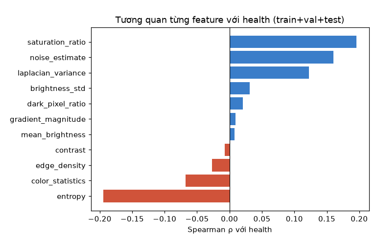 | 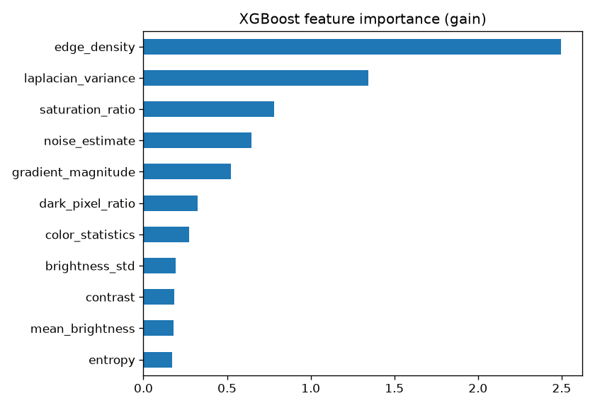 |
|---|---|

`edge_density` và `laplacian_variance` là hai feature XGBoost dùng nhiều nhất (gain cao nhất).

**Kiểm chéo với bản tính độc lập của teammate** (`rain_features_csv/`, 1 000 ảnh mưa thật, tính trên ảnh gốc 1920×1080): Spearman ≥ 0.94 ở 10/11 feature. `noise_estimate` đạt 0.82 vì nhạy với độ phân giải. Khác biệt chính là đơn vị (brightness 0–255 so với 0–1) và độ phân giải (`laplacian_variance` lớn gấp ×2.3). Khi đưa feature của teammate vào model (chỉ đổi đơn vị brightness), health dự đoán chỉ lệch trung bình 0.014. Chi tiết: [outputs/results/feature_crosscheck.csv](../outputs/results/feature_crosscheck.csv), [figures/feature_crosscheck.png](figures/feature_crosscheck.png). → **Data contract phải cố định độ phân giải (1280×720) và đơn vị.**

## 6. Mô hình & Benchmark (Member 3)

XGBoost (`max_depth 5`, `lr 0.03`, early stopping trên val ở vòng 260), train trên 3 930 ảnh. Đánh giá trên **6 330 ảnh test** (sequence khác train):

| Model | #feat | MAE ↓ | RMSE ↓ | R² ↑ | Pearson | Spearman | Acc | Macro-F1 |
|---|---|---|---|---|---|---|---|---|
| Rule-based (khoảng cách tới ảnh khoẻ) | 11 | 0.254 | 0.360 | −0.24 | 0.02 | 0.07 | 0.523 | 0.308 |
| Linear Regression | 11 | 0.179 | 0.230 | 0.494 | 0.712 | 0.675 | 0.626 | 0.607 |
| Random Forest | 11 | **0.144** | 0.202 | 0.611 | 0.794 | **0.747** | 0.723 | 0.678 |
| LightGBM | 11 | 0.148 | 0.206 | 0.595 | 0.788 | 0.735 | 0.717 | 0.664 |
| **XGBoost** (chọn) | 11 | 0.146 | **0.199** | **0.621** | **0.796** | 0.746 | **0.733** | **0.686** |
| XGBoost + grid 3×3 | 47 | 0.155 | 0.208 | 0.587 | 0.787 | 0.738 | 0.712 | 0.671 |

Nguồn: [outputs/results/results.csv](../outputs/results/results.csv), log [outputs/logs/health_model_run.log](../outputs/logs/health_model_run.log).

| 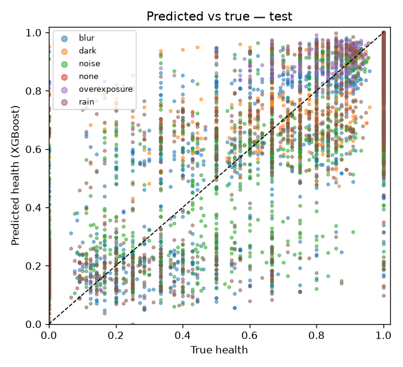 | 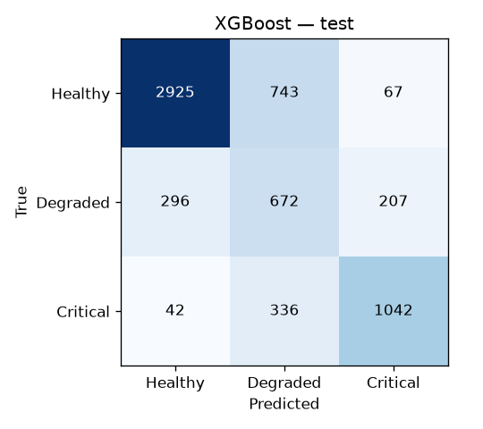 |
|---|---|

**Theo từng loại/mức** ([results_by_degradation.csv](../outputs/results/results_by_degradation.csv)): model bám đúng xu hướng giảm của mọi loại. Sai số thấp ở hai đầu (clean 0.03, overexposure L1 0.05) và cao nhất ở **mức trung gian** (rain L2, noise L2/3, blur L3, dark L2: MAE ≈ 0.21). Đây chính là vùng detector "lúc thấy lúc không".

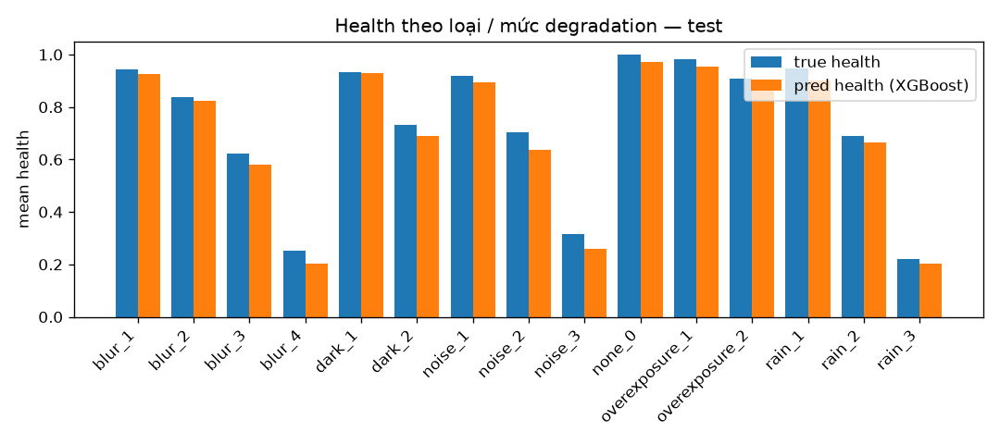

**Confusion matrix (test):** Healthy F1 0.84, Critical F1 0.76, Degraded F1 0.46 (lớp hẹp nhất, bị kẹp giữa hai lớp kia). Về an toàn: **42/1 420 ảnh Critical (3%) bị chấm Healthy** (bỏ sót nguy hiểm) và 67/3 735 ảnh Healthy bị chấm Critical (báo động giả).

### Demo sản phẩm

```bash
python -m health_model.predict <ảnh hoặc thư mục> [--csv out.csv]
```

Output thật trên 8 biến thể của cùng một cảnh ([outputs/logs/demo_predict.log](../outputs/logs/demo_predict.log)):

| ảnh | health | class | camera weight |
|---|---|---|---|
| clean | 0.963 | Healthy | 0.963 |
| rain L1 / L2 / L3 | 0.885 / 0.674 / 0.202 | Healthy / Degraded / Critical | 0.885 / 0.674 / 0.202 |
| blur L2 | 0.793 | Degraded | 0.793 |
| noise L3 | 0.108 | Critical | 0.108 |
| dark L2 | 0.698 | Degraded | 0.698 |
| overexposure L2 | 0.843 | Healthy | 0.843 |

`camera_weight = health` là hệ số mà module fusion (Member 4, `demo/adaptive_weight.py`) dùng để giảm ảnh hưởng của camera kém.

## 7. Failure cases

**F1 — Ảnh mưa thật: model gần như "mù".** Trên 1 000 ảnh mưa thật, health dự đoán có trung bình 0.966, độ lệch chuẩn 0.026, chỉ 0.1% ảnh < 0.8. Trong khi đó proxy recall (YOLO11s so với YOLO11x trên chính ảnh đó) < 0.7 ở 11% ảnh. Spearman(pred, proxy) = −0.05.

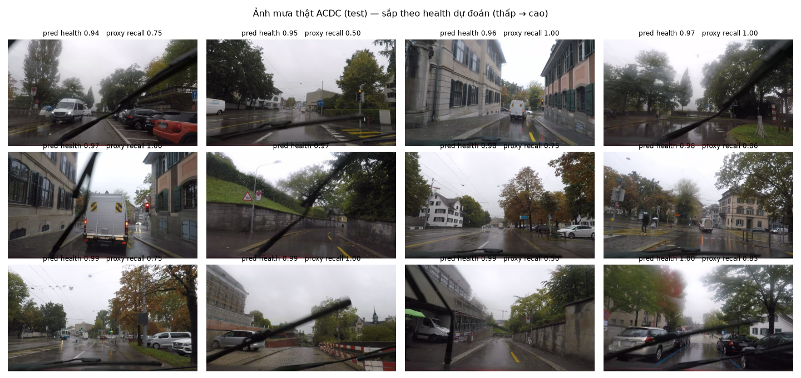

Nguyên nhân nhìn thấy được trong ảnh: mưa thật trong ACDC chủ yếu là **mặt đường ướt, trời u ám và cần gạt nước che một dải ảnh**. Ảnh vẫn nét và đủ sáng, nên 11 feature toàn ảnh trông "khoẻ". Lỗi thật mang tính **cục bộ** (vật che, giọt nước trên kính), loại mà degradation tổng hợp toàn ảnh không mô phỏng. Đây là **domain gap synthetic → real** điển hình. Lưu ý thêm: proxy recall cũng không phải ground truth, vì YOLO11x cũng bị mưa ảnh hưởng.

**F2 — Nhiễu nhãn khi ít object.** MAE theo số object trong pseudo-GT: 3–4 object → 0.190; 5–6 → 0.161; 7–9 → 0.138; ≥10 → 0.115. Các ca sai nặng nhất đều là ảnh chỉ có 3 object. Ví dụ `GP020400_frame_000048`: dark L1 / blur L1 / noise L1 đều có nhãn health = 0 (detector trượt cả 3 object nhỏ) nhưng model dự đoán 0.91–0.95. Ngược lại, có ảnh rain L3 vẫn có nhãn health = 1.0 vì 3 object đều lớn và gần. Với ít object, recall chỉ nhận vài giá trị rời rạc nên nhãn nhảy cóc. Model "sai" ở đây phần lớn là do nhãn nhiễu.

**F3 — Rule-based không xếp hạng được.** Mỗi feature phản ứng theo cả hai chiều (noise làm Laplacian ↑, blur làm ↓). Giá trị tuyệt đối của feature lại phụ thuộc vào nội dung cảnh (đường vắng so với phố đông) nhiều hơn phụ thuộc vào degradation. Rule "lệch khỏi ảnh khoẻ" chỉ đạt Spearman 0.07. Phiên bản rule đầu tiên (phạt một chiều từng feature) còn tệ hơn (Pearson 0.005).

**F4 — Mức trung gian và lớp Degraded.** F1 lớp Degraded chỉ 0.46. 743 ảnh Healthy bị đẩy xuống Degraded. Nếu dùng làm cảnh báo, đây là báo động sớm khá nhiều.

## 8. Engineering decisions & trade-offs

| Quyết định | Lý do | Trade-off |
|---|---|---|
| Nhãn = recall ratio từ detector, không dùng PSNR/SSIM | §4: sai khác pixel ≠ suy giảm perception | Phụ thuộc detector cụ thể (YOLO11s); đổi detector phải tạo lại nhãn |
| Pseudo-GT YOLO11x thay vì GT người gán | Bản Kaggle không có box | Bỏ qua object YOLO11x cũng không thấy; recall tương đối chứ không tuyệt đối |
| Degradation tổng hợp pixel-aligned | Cách duy nhất có cặp sạch/bẩn cùng object để tính recall | Domain gap với mưa thật (F1) |
| Bỏ ảnh < 3 object | Giảm nhiễu nhãn (F2) | Mất ~25% dữ liệu; model ít thấy cảnh vắng |
| Giữ split ACDC theo sequence | Tránh rò rỉ cảnh giữa train/test | Train nhỏ (400 ảnh gốc) so với test (500) |
| XGBoost 11 feature thay vì CNN | Nhanh trên CPU, giải thích được qua feature importance, ít dữ liệu vẫn chạy | Không "nhìn" được lỗi cục bộ như cần gạt nước |
| Không dùng grid 3×3 cho model chính | Thêm 36 feature làm kém hơn (MAE 0.155 so với 0.146), có thể do overfit vì train chỉ 3 930 mẫu | Mất khả năng định vị lỗi cục bộ; nên thử lại khi có degradation cục bộ |
| XGBoost thay vì Random Forest | Ngang nhau trên test; XGBoost tốt hơn ở RMSE/R²/F1, model nhỏ, có early stopping | RF có MAE/Spearman nhỉnh hơn một chút |
| Resize 1280×720 trước khi tính feature | Feature phụ thuộc độ phân giải (§5) | Mất chi tiết nhỏ của ảnh gốc 1080p |

## 9. Hướng cải thiện

1. Thêm degradation **cục bộ**: giọt nước/vết bẩn trên kính, vật che kiểu cần gạt, glare một vùng. Khi đó bật lại feature lưới 3×3.
2. Lấy GT box thật (ACDC panoptic từ website gốc hoặc Cityscapes) để thay pseudo-GT và kiểm chứng trực tiếp trên mưa thật.
3. Nhãn mượt hơn: dùng tổng confidence hoặc mAP thay vì recall đếm; gộp theo cửa sổ thời gian vài frame.
4. Trộn thêm fog/night/snow của ACDC để model gặp nhiều kiểu suy giảm hơn.

## 10. Tái lập kết quả

```bash
python -m venv .venv && .venv/Scripts/activate        # Windows; Linux: source .venv/bin/activate
pip install -r requirements.txt

# (1) Kaggle GPU: degradation + YOLO + features  (KAGGLE_API_TOKEN trong .env)
python kaggle/build.py
kaggle kernels push -p kaggle/kernel --accelerator NvidiaTeslaT4
kaggle kernels output nguyendangthuc11/camera-health-acdc-rain -p outputs/kaggle
cp outputs/kaggle/features.csv outputs/features/
cp outputs/kaggle/per_image_metrics.csv outputs/kaggle/real_rain_proxy.csv outputs/perception/
(cd outputs/kaggle && mkdir -p examples && cd examples && unzip -o ../examples.zip)

# (2) Local: nhãn, train, benchmark, hình
python -m health_model.make_labels
python -m health_model.train_xgboost
python -m health_model.evaluate
python -m features.crosscheck
python -m reports.make_figures
python -m health_model.predict outputs/kaggle/examples/GOPR0572_frame_000255_ref/
```

| Bằng chứng | Đường dẫn |
|---|---|
| Bảng metric | `outputs/results/results.csv`, `results_by_degradation.csv`, `feature_crosscheck.csv` |
| Dự đoán từng ảnh | `outputs/results/predictions.csv`, `real_rain_predictions.csv` |
| Log | `outputs/logs/health_model_run.log`, `feature_crosscheck.log`, `demo_predict.log` |
| Model | `health_model/model/model_xgb.json` (+ `.features.json`) |
| Hình | `reports/figures/` |

## Tài liệu tham khảo

- C. Sakaridis, D. Dai, L. Van Gool. *ACDC: The Adverse Conditions Dataset with Correspondences.* ICCV 2021.
- Ultralytics YOLO11 — https://github.com/ultralytics/ultralytics
- T. Chen, C. Guestrin. *XGBoost: A Scalable Tree Boosting System.* KDD 2016.
- G. Ke et al. *LightGBM.* NeurIPS 2017.
- J. Immerkær. *Fast Noise Variance Estimation.* CVIU 1996.
- D. Hasler, S. Süsstrunk. *Measuring Colourfulness in Natural Images.* SPIE 2003.
- D. Hendrycks, T. Dietterich. *Benchmarking Neural Network Robustness to Common Corruptions and Perturbations* (ImageNet-C). ICLR 2019.
