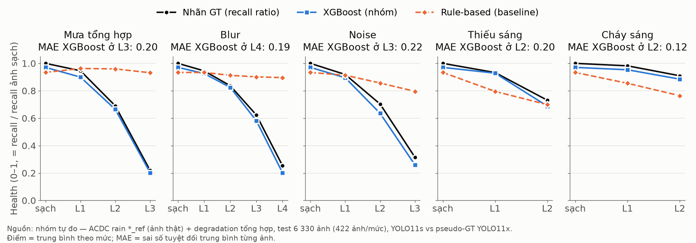

# Báo cáo cá nhân — Nguyễn Đăng Thực (2A202603014)

**Vai trò:** Ground Truth + XGBoost (Member 3) · **Nhóm:** LiDAR · **Repo nhóm:** `[URL repo]` · **Commit:** `[commit hash]`
**Slide:** [Camera Health ADAS — Nguyễn Đăng Thực](https://claude.ai/artifact/PiBAjYFM5ktSc6DxEMDcHG) (bản PDF/PPTX: `reports/individual/2A202603014_NguyenDangThuc_slides.pdf`) · **Báo cáo nhóm:** [../REPORT.md](../REPORT.md)

> Quy ước: **[Nguồn]** là kết luận của paper/repo; **[Nhóm đo]** là kết quả nhóm tự benchmark trong repo này.

## 1. Problem

- **Nền tảng:** xe con có ADAS mức L2, một camera RGB nhìn phía trước.
- **Tính năng:** phát hiện xe, người, xe máy cho cảnh báo va chạm trước (FCW) và phanh khẩn cấp (AEB).
- **Sensor:** camera 1920×1080 gắn kính lái (ACDC, Thụy Sĩ), xử lý ở 1280×720.
- **Failure thực tế:** mưa, mờ nét, nhiễu, thiếu sáng, cháy sáng làm detector bỏ sót object mà hệ thống không biết. **[Nhóm đo]** Recall YOLO11s: ảnh sạch 0.93 → rain L3 0.20, blur L4 0.21, noise L3 0.26.
- **Câu hỏi:** chỉ từ ảnh camera, ước lượng camera còn đáng tin bao nhiêu cho perception (health ∈ [0, 1]), đủ rẻ để chạy mọi frame?

## 2. Method

- **Thuật toán:** 11 IQA features toàn ảnh (Laplacian variance, mean brightness, brightness std, contrast, entropy, saturation ratio, dark pixel ratio, noise estimate, edge density, gradient magnitude, colorfulness) → **XGBoost regression** (depth 5, lr 0.03, early stopping ở vòng 260 trên val) → health, lớp (Healthy ≥ 0.8 · Degraded 0.5–0.8 · Critical < 0.5) và camera weight = health.
- **Nhãn (phần tôi thiết kế):** `health = recall_YOLO11s(ảnh bẩn) / recall_YOLO11s(ảnh sạch cùng cảnh)`, clip [0, 1]. Pseudo-GT = YOLO11x (conf 0.4) trên ảnh sạch; matching IoU ≥ 0.5 cùng lớp; bỏ ảnh < 3 object.
- **Input / Output:** 1 ảnh RGB → health, lớp, camera weight. Detector chỉ chạy offline để tạo nhãn.
- **Giả định:** (G1) YOLO11x trên ảnh sạch ≈ GT; (G2) recall YOLO11s đại diện cho perception ADAS; (G3) lỗi camera là lỗi toàn ảnh. G3 bị phá ở failure case.
- **Nguồn:**
  - **[Nguồn]** ACDC (Sakaridis, Dai, Van Gool, ICCV 2021): 4 006 ảnh fog/night/rain/snow, mỗi ảnh kèm ảnh tham chiếu điều kiện thường; điều kiện xấu làm giảm segmentation SOTA.
  - **[Nguồn]** ImageNet-C (Hendrycks & Dietterich, ICLR 2019): corruption chia mức độ, độ chính xác mô hình giảm dần theo mức. Nhóm mượn ý tưởng chia mức lỗi.
  - **[Nguồn]** YOLO11 (Ultralytics, https://github.com/ultralytics/ultralytics): detector real-time pretrained COCO.
  - **[Nguồn]** XGBoost (Chen & Guestrin, KDD 2016).
- **Code:** [health_model/make_labels.py](../../health_model/make_labels.py), [train_xgboost.py](../../health_model/train_xgboost.py), [baselines.py](../../health_model/baselines.py), [evaluate.py](../../health_model/evaluate.py), [predict.py](../../health_model/predict.py), [kaggle/pipeline.py](../../kaggle/pipeline.py).
- **Dataset:** https://www.kaggle.com/datasets/njayadithya/rgb-anon-trainvaltest (`rgb_anon/rain`). Kaggle kernel `nguyendangthuc11/camera-health-acdc-rain`, version 2, GPU T4.

## 3. Benchmark — [Nhóm đo]

- **Dữ liệu:** ảnh **thật** ACDC rain `*_ref` (1 000 ảnh trời quang) + **14 mức lỗi tổng hợp** khớp pixel → 11 280 nhãn. Split giữ nguyên theo sequence của ACDC: train 3 930 / val 1 020 / **test 6 330**. Ngoài ra có 1 000 ảnh mưa **thật** để kiểm tra ngoài phân phối.
- **Cấu hình:** Python 3.14, xgboost 3.4.1, scikit-learn 1.9.1, lightgbm 4.7.0 (local); ultralytics bản pip trên Kaggle ngày 2026-10-05; seed 42; `configs/config.yaml`.
- **Metric:** MAE, RMSE (cùng đơn vị health 0–1), R², Spearman; Accuracy và macro-F1 cho 3 lớp.

| Model | Vai trò | MAE ↓ | RMSE ↓ | R² ↑ | Spearman ↑ | Acc | Macro-F1 |
|---|---|---|---|---|---|---|---|
| Rule-based | baseline | 0.254 | 0.360 | −0.24 | 0.07 | 0.52 | 0.31 |
| Linear Regression | baseline | 0.179 | 0.230 | 0.49 | 0.67 | 0.63 | 0.61 |
| Random Forest | so sánh | **0.144** | 0.202 | 0.61 | **0.75** | 0.72 | 0.68 |
| LightGBM | so sánh | 0.148 | 0.206 | 0.60 | 0.73 | 0.72 | 0.66 |
| **XGBoost (chọn)** | mô hình chính | 0.146 | **0.199** | **0.62** | **0.75** | **0.73** | **0.69** |
| XGBoost + lưới 3×3 (47 feat) | ablation | 0.155 | 0.208 | 0.59 | 0.74 | 0.71 | 0.67 |

**Biểu đồ chính** — health theo từng mức lỗi: nhãn GT, XGBoost và baseline rule-based, kèm MAE ở mức nặng nhất:



- Sai số lớn nhất ở mức trung gian (rain L2, noise L2–3, blur L3: MAE ≈ 0.21); ảnh sạch chỉ 0.03.
- An toàn: 42 / 1 420 ảnh Critical (3%) bị chấm Healthy.
- Nguồn số liệu: [results.csv](../../outputs/results/results.csv), [results_by_degradation.csv](../../outputs/results/results_by_degradation.csv), log [health_model_run.log](../../outputs/logs/health_model_run.log).
- Ví dụ GT theo từng mức: [examples_GOPR0572_frame_000255_ref.png](../figures/examples_GOPR0572_frame_000255_ref.png).

## 4. Failure case — ảnh mưa thật

- **Hiện tượng [Nhóm đo]:** trên 1 000 ảnh mưa thật, health dự đoán trung bình **0.966** (độ lệch chuẩn 0.026); chỉ 0.1% ảnh dưới 0.8. Trong khi đó **11%** ảnh có proxy recall < 0.7 (YOLO11s so với YOLO11x trên chính ảnh đó). Tương quan giữa health dự đoán và proxy: **Spearman −0.05** (n = 646).
- **Nguyên nhân phía sensor:** mưa thật trong ACDC chủ yếu là đường ướt, trời u ám và **cần gạt nước che một dải ảnh**. Ảnh vẫn nét và đủ sáng, nên 11 feature toàn ảnh trông "khoẻ". Lỗi thật là lỗi **cục bộ**, không có trong dữ liệu train tổng hợp (domain gap synthetic → real).
- **Ảnh hưởng tới tính năng:** camera weight giữ khoảng 0.97 trong lúc detector đang mất object, nên fusion tiếp tục tin camera. Đây là kiểu lỗi nguy hiểm nhất với FCW/AEB.
- **Giới hạn của phân tích:** proxy recall không phải GT, vì YOLO11x cũng bị mưa ảnh hưởng.
- Hình: [real_rain_examples.png](../figures/real_rain_examples.png), dữ liệu: [real_rain_predictions.csv](../../outputs/results/real_rain_predictions.csv).

## 5. Engineering decision

**Quyết định:** health score là **một tín hiệu**, không làm gate an toàn duy nhất. Lý do từ số đo: tốt với lỗi toàn ảnh (Spearman 0.75 trên test) nhưng mù với lỗi cục bộ (ρ = −0.05 trên mưa thật), và 3% ảnh Critical bị chấm Healthy.

- **Log:** ghi mỗi frame 11 feature, health, lớp và số object/track detector thấy. Health cao mà track mất dần là dấu hiệu của failure case.
- **Fallback:** health < 0.5 → hạ weight camera, ưu tiên radar/LiDAR, cảnh báo tài xế. Health cao nhưng track mất đột ngột → không tin health, hạ weight theo detector.
- **Cải tiến gắn với failure case:** thêm lỗi **cục bộ** (giọt nước, cần gạt, glare một vùng) vào dữ liệu train, rồi bật lại 36 feature lưới 3×3. Lưới 3×3 hiện làm kém hơn (MAE 0.155 so với 0.146) vì dữ liệu chỉ có lỗi toàn ảnh.
- **Dữ liệu cần tiếp theo:** GT box thật (ACDC panoptic từ website gốc) để đo recall trực tiếp trên mưa thật, thay cho proxy.
- **Trade-off:**
  - **Nên dùng** khi lỗi là lỗi toàn ảnh, khi cần chạy rẻ mỗi frame (~0.12 s/ảnh trên 1 nhân CPU, đo local, chưa tối ưu; XGBoost < 1 ms), và khi cần giải thích bằng feature importance.
  - **Không nên dùng** cho lỗi cục bộ, không làm gate duy nhất, và không chuyển sang detector hay độ phân giải khác mà không tạo lại nhãn. Feature teammate tính ở 1080p lệch ×2.3 với `laplacian_variance`.

## Bằng chứng chạy

```bash
# Kaggle GPU T4: degradation + YOLO + features
python kaggle/build.py
kaggle kernels push -p kaggle/kernel --accelerator NvidiaTeslaT4
kaggle kernels output nguyendangthuc11/camera-health-acdc-rain -p outputs/kaggle
# Local: nhãn, train, benchmark, hình, demo
python -m health_model.make_labels
python -m health_model.train_xgboost
python -m health_model.evaluate
python -m reports.make_main_chart
python -m health_model.predict outputs/kaggle/examples/GOPR0572_frame_000255_ref/
```

## Kịch bản pitch (3–5 phút)

| Slide | Thời gian | Ý chính |
|---|---|---|
| 1–2 Problem | 0:00–0:45 | ADAS L2, camera trước, FCW/AEB; recall 0.93 → 0.20 khi mưa nặng mà hệ thống không biết |
| 3–4 Method | 0:45–1:45 | Nhãn = recall ratio từ detector; 11 feature → XGBoost; nguồn so với phần nhóm tự làm; 3 giả định |
| 5–7 Benchmark | 1:45–3:00 | Bảng 6 model, Spearman 0.75 so với 0.07; biểu đồ chính; ví dụ GT: sai khác pixel ≠ suy giảm perception |
| 8 Failure | 3:00–3:50 | Mưa thật 0.966, 11% proxy < 0.7, ρ −0.05; nguyên nhân là cần gạt, lỗi cục bộ |
| 9–11 Decision | 3:50–4:50 | Log, fallback, dữ liệu tiếp theo; khi nào nên/không nên; mở log nếu được hỏi |

## Tự kiểm trước pitch

- [x] Nền tảng, tính năng, sensor cụ thể (§1)
- [x] Metric định lượng, baseline, điều kiện lỗi (§3: bảng + biểu đồ theo mức)
- [x] Log, ảnh, plot và một failure case (§3, §4)
- [x] Link nguồn, dataset, lệnh chạy (§2, Bằng chứng chạy)
- [ ] **Commit hash và URL repo:** điền sau khi push
- [x] Phân biệt [Nguồn] và [Nhóm đo]
- [x] Một cải tiến + fallback gắn với failure case (§5)
- [ ] Xuất slide ra PDF/PPTX, lưu vào `reports/individual/`, nộp VLearn kèm URL repo
